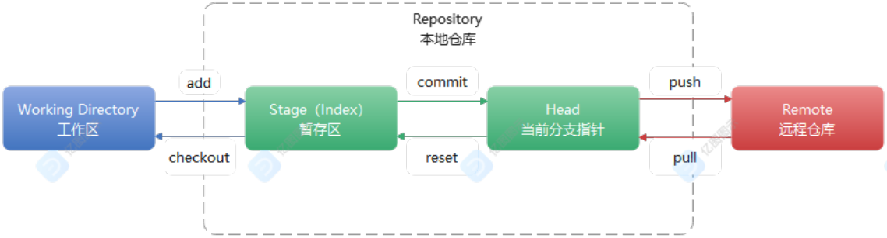
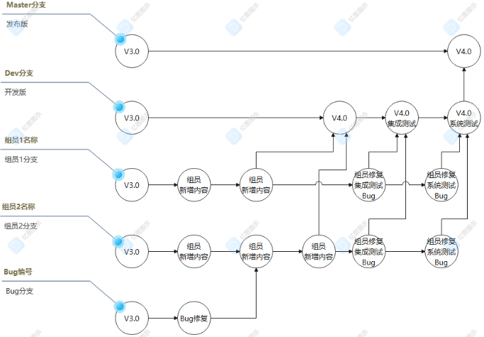

## Git

### Git 简介

​    Git是一个开源的分布式版本控制系统，可以有效、高速地处理从很小到非常大的项目版本管理。是Linus Torvalds为了帮助管理Linux内核开发而开发的一个开放源码的版本控制软件。

### Git 作用

+ 版本控制

+ 团队协作
  
  

### Git 安装

​    Git官网：https://git-scm.com/

​    下载Git安装程序

### 设置本机Git账号

​    $ git config --global user.name "你的账户名称"

​    $ git config --global user.email "你的电子邮箱"

### Git Bash 命令

​    $ pwd                显示当前路径

​    $ ls                    显示当前路径下的所有子路径

​    $ cd ..                返回上级路径

​    $ cd [路径]            改变路径

​    $ mkdir [文件夹名称]    创建文件夹

​    $ rm -r [文件夹名称]    删除文件夹

​    $ touch [文件名]        新建文件

​    $ rm [文件名]            删除文件


​    

### 本地仓库 Repository

​    $ git init                            设置当前路径为Repository

```bash
// 在D:/java36/temp  执行git命令
git init // 将当前目录初始化为一个本地仓库

touch aaa.txt	// 创建了一个普通的文件

git add aaa.txt // 将这个aaa.txt从工作目录添加到暂存区
```


 	$ git add [文件名]                    从Working Directory添加到Stage

​    $ git commit -m "commit说明"        从Stage提交到HEAD

​    $ git commit -a -m "commit说明"    从Working Directory提交到HEAD

​    $ git status                        查看git状态

​    $ git diff                            查看Working Directory和Repository差异

​    $ git log                            查看commit日志

​    $ git reset --hard [commit_id]        回退指定id的commit

​    $ git reset --hard HEAD~n            回退到前n个commit

​    $ git checkout -- [文件名]            撤销Working Directory的变更内容

​    $ git reset HEAD [文件名]            撤销Stage的变更内容


### 使用TortoiseGit操作本地仓库

#### 初始化仓库

```tex
1.新建一个文件夹，进入文件夹内部操作
右键--->Git 在这里新建版本库

注意事项: 不要在桌面上直接操作
```


    ```tex
    使用命令操作
    先进入需要操作的目录
    1.右键---》Git Bash Here
    2.输入git init
    ```


​    

​    

​    

​    操作成功，当前目录下会多出一个.git，注意这个是一个隐藏文件，需要勾选查看隐藏项目；并且当前文件夹图标会多出一个绿色的√


#### 添加提交文件

**使用可视化界面**

```tex
1.在仓库新建一个文件，
2.在当前文件夹中--->右键--->TortoiseGit---> 添加
3.点击添加之后会让你选择哪些文件添加到暂存区
4.上一步确定之后，会有提交选项，可以选择哪些文件提交到本地仓库
```


**git命令**

```tex
1.进入到本地仓库目录
2.打开控制台
3.创建文件
4.提交文件到暂存区
5.将暂存区的文件提交到本地仓库
```


#### 修改文件

当修改了工作目录的文件内容之后，可以使用可视化工具查看文件的改动


可以查看到哪些文件发生了变更


如果使用命令，可以使用git diff 查看差异


修改文件之后，可以将文件提交


#### 查看日志

提交之后，可以使用这个工具查看日志


如果使用命令行，那么可以使用git log查看

#### 回退版本

```tex
在查看日志界面可以回退到指定版本
```


如果使用命令：

```bash
 git reset --hard [commit_id] 
```


#### 删除文件

删除工作目录中的文件

```tex
如果直接选择某个文件删除，那么删除的只是本地工作区的文件，你的本地仓库并没有删除，这个时候是可以直接回退
```


从本地仓库删除

```tex
如果真的需要删除这个文件，不仅要在工作·目录删除，还需要提交删除到本地仓库
```


#### 忽略提交

如果在项目中新增了很多代码并且还有很多其他文件，如果有的文件是不需要提交的，怎么办，忽略提交

```tex
如果有需要忽略提交的文件，可以将这些文件放到某个文件夹中，选中这个文件夹,在可视化工具中添加到忽略提交
```


### 分支 Branch

#### 创建分支

​    $ git branch [你的分支名称]    创建分支

​    $ git switch [你的分支名称]            切换当前分支

​    $ git switch -c [你的分支名称]    创建并切换当前分支

​    $ git branch                                    查看分支

#### 合并分支

​    $ git merge [指定分支名称]           将指定分支合并到当前分支

#### 删除分支

​    $ git branch -d [你的分支名称]    删除分支

#### 合并分支冲突

```tex
什么是冲突:
	A，修改了一个类Util.class,里面第三行代码定义了一个变量aaa,同时B也去定义了一个变量bbb，如果这两个人不知道对方的需求，同时提交了代码，那么就会发生代码冲突: 第三行这个变量到底用谁的，这个情况就是代码冲突
```


### 使用TortoiseGit管理分支

#### 创建分支


#### 查看切换分支

**查看分支**


**切换分支**


#### 合并分支

加入我们要将这个dev合并到master分支，需要先切换到maser，再合并


#### 删除分支


#### 合并分支冲突


在dev1中将aaa.txt中的内容修改成hello world,在dev2中将aaa.txt中的内容修改成你好 世界

master先合并dev1再合并dev2


自行编辑冲突


### 远程仓库 Remote

#### Github

##### Github 简介

​    GitHub是一个面向开源及私有软件项目的托管平台，因为只支持Git作为唯一的版本库格式进行托管，故名GitHub。

​    GitHub于2008年4月10日正式上线，除了Git代码仓库托管及基本的Web管理界面以外，还提供了订阅、讨论组、文本渲染、在线文件编辑器、协作图谱（报表）、代码片段分享（Gist）等功能。

​    2018年6月4日，微软宣布，通过75亿美元的股票交易收购代码托管平台GitHub。

##### Github 注册账号

​    Github官网：https://github.com/

##### SSH Key

1. 创建SSH Key（**可以确定哪台电脑可以使用仓库**）

   $ ssh-keygen -t rsa -C "你的电子邮箱"    创建SSH Key

​    id_rsa    =>    private key 私钥

​    id_rsa.pub    =>    public key 公钥

2. Github添加SSH公钥

   Github官网 -> 个人头像 -> Settings -> SSH and GPG keys -> New SSH Key

   Title    随意填写

   Key    填写id_rsa.pub公钥

   

##### Github Repository

1. Github 创建Repository远程仓库

   Github官网 -> 个人头像 -> Your repositories -> New

   Repository name    填写仓库名称

   点击    【Create Repository】

2. Git关联远程仓库

   $ git remote add origin [你的Github仓库SSH地址]        Git本地仓库关联Github远程仓库

3. Git推送Push

   $ git push -u origin master                    Git本地仓库推送Github远程仓库（并且关联master分支）

   $ git push                   Git本地仓库推送Github远程仓库

4. Git克隆Clone

   $ git clone [你的Github仓库SSH地址]        Github远程仓库克隆到Git本地仓库

5. Git拉取Pull

   $ git pull                   拉取远程仓库与本地仓库同步

#### Gitee

##### Gitee 简介

​    Gitee是开源中国（OSChina）推出的基于Git的代码托管服务。

​    Gitee包括三个版本，分别是：社区版、企业版和高校版。

##### Gitee 注册账号

​    Gitee官网：https://gitee.com/

##### SSH Key

1. 创建SSH Key

   $ ssh-keygen -t rsa -C "你的电子邮箱"   三次回车  创建SSH Key

2. Gitee添加SSH公钥

   Gitee官网 -> 个人头像 -> 设置 -> SSH公钥

   标题    随意填写

   公钥    填写id_rsa.pub公钥

##### Gitee Repository

1. Gitee 创建Repository远程仓库

   Gitee官网 -> Gitee -> 仓库 -> 【+】

   仓库名称    填写仓库名称

   点击    【创建】


##### 将本地代码推送到远程仓库中

```bash
1.找到需要推送到远程仓库的代码所在的文件夹
2.初始化本地仓库
git init
3.建议再本地仓库中添加一个README.md文档
touch README.me 
git add README.md
git commit -a -m "提交了readme文档"
4.将需要托管的代码提交到本地仓库中
5.将本地仓库和远程仓库关联起来(ssh地址)
git remote add origin 远程仓库的ssh地址
6.将本地仓库的代码推送到远程仓库
git push -u origin "master"
```


本地仓库中的代码修改完毕之后，直接使用git push 进行推送


##### 从远程仓库中克隆代码

```bash
复制远程仓库的ssh地址
找到某个文件夹，git clone ssh地址
```

##### 冲突问题

```bash
注意:在提交代码时，一定要先拉去最新的代码，解决冲突再推送
```


### 再idea中使用git

##### 将本地代码推送到远程仓库

先在idea中配置号git环境和gitee(github)账户


如果想要将当前项目托管到gitee


选择一个项目初始化本地仓库


如果没有爆红则提交成功


##### 从远程仓库克隆代码


> 剩余操作同Github



### 分支策略

#### 分支策略



| 分支名称 | 分支作用            | 仓库位置   | 是否可运行 | 备注 |
| -------- | ------------------- | ---------- | ---------- | ---- |
| master   | 发布版              | 远程、本地 | 是         |      |
| dev      | 项目组团队的开发版  | 远程、本地 | 是         |      |
| 组员分支 | 组员自己的开发版    | 本地       | 否         |      |
| bug分支  | 紧急修复生产环境Bug | 本地       | 是         | 临时 |

#### 远程仓库分支

​    $ git checkout -b [本地分支名称] [origin/远程分支名称]    从远程仓库分支抓取到本地仓库分支
