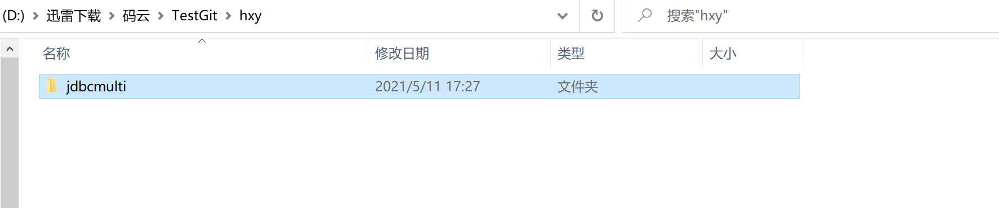
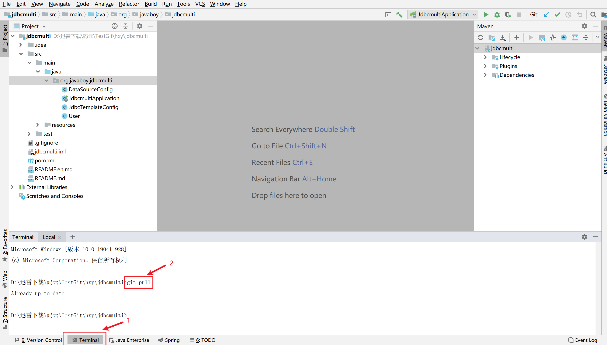
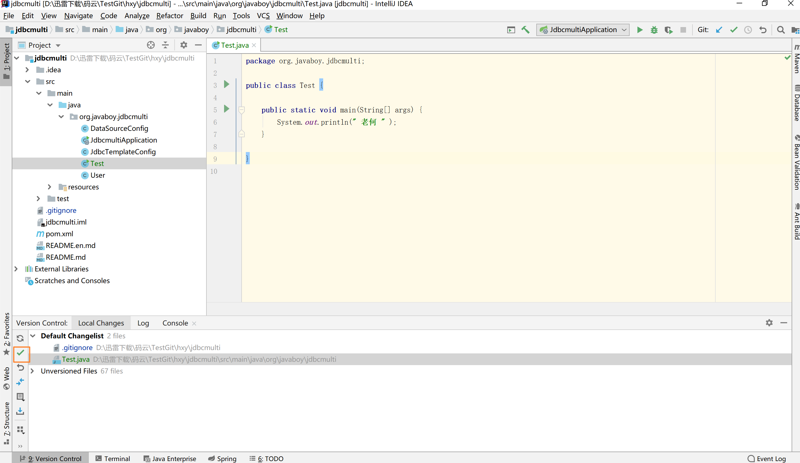

#### 一、本地项目初次提交到远程仓库管理

##### 1.查看我们的项目

如下图所示，我们的项目名称叫做 jdbcmulti


##### 2.建立远程仓库

仓库的名称和项目名同名


项目创建完成


**补充：**.gitignore文件我们可以在里面标出哪些文件是不需要被git管理的。

​           README.md：项目文档，用来和别人介绍我们这个项目的

这两个文件可以自己在本地手动编写、也可以用idea工具快捷方式帮我们添加、也可以在创建远程仓库（码云、github、gitLab）时候在页面上操作

**建议：**如果还没熟练掌握的话，推荐大家在页面控制台创建远程仓库时候一起创建一下，拉取到本地之后再做适当更改即可。


##### 3.本地项目关联远程仓库并完成推送

**打开项目所在文件夹, 在文件夹上右键运行: git bash here**


###### 1.执行命令：git  init


执行完之后会生成   .git文件


###### 2.继续执行命令：git add .  

```
 git add .  
```

带个点表示一次性提交。也可以git add 一个一个文件添加


###### 3.git commit -m  "本次提交的内容描述"

```
git commit -m  "first commit"
```


###### 4.git remote add origin  远程仓库地址

```
git remote add origin  https://gitee.com/hexiangyan/jdbcmulti.git
```


###### 5.本地仓库和远程仓库master分支关联（这一步可以省略，直接执行第6步）

```
git pull
git branch --set-upstream-to=origin/master master
git pull
git pull origin master --allow-unrelated-histories
```


这四个命令一步步执行  —  为什么要按顺序执行上面的命令


从图上的报错信息，我们知道本地仓库的分支和远程仓库的分支没有关联起来：

执行下图命令本地master关联远程master


再pull一下


**报错：“不能合并没有联系的历史”**：即提交的内容不一，没有共同的提交。

执行命令：git pull origin master --allow-unrelated-histories    

这个命令的意思就是—我允许你们在一起。


###### 6.推送本地代码到远程仓库

```
git push  -u origin master
```


###### 7.查看远程仓库


可以看到本地代码已经提交上去了


#### 二、工作中如何拉取代码

刚到公司：你们组项目经理自己会用他的账号给你们分配添加到相应的项目组

因为一个项目组来说一般不只一个项目、就算只有一个项目，那么也会分多个模块。

咱们作为开发人员是没有权限接触到所有的模块的。


##### 1.拉取项目到本地

######    **1、找到经理分给你的项目：复制https地址**


######   **2、选一个空文件作为你的工作空间**


右击: **git bash here** 


###### 3、clone项目


项目已经被拉下来了




###### 4、导入项目到idea

4.1 idea集成本地git：

**一般我们不需要自己手动配，git会扫描我们本地环境变量，自动添加**


2.打开刚才拉下来的项目


导入项目成功


我们pull一下，成功。


#### 三、聊点别的

##### 1.导入项目

1.我是用先拉到本地，再导入的形式。—这种方式在实际开发中用的比较多

2.我们也可以复制地址到idea中直接拉取（这种方式大家自己尝试，不作演示）


##### 2.idea工具

###### 2.1   pull代码

**方式1**



**方式二**

**蓝色小箭头**


###### 2.2   commit代码


两个小勾勾一样的，用哪一个都行

**补充：**如果没有Version Control栏 ，点一下这个小时钟按钮就可以了


点这里也是一样的，咱们怎么简单怎么来。


###### 2.3 开始撸代码

代码都拉下来了，经理任务也分了，我们要开始码代码了。

**1.新建的Test类，idea工具会跳出一个弹框，提示是否添加到git管理。我们点击add—>刚刚新建的类变成绿色了**

**（相当于已经执行了 git add命令**）


**2.add完之后需要commit**

选中我们需要提交的代码。点这个绿色小箭头。相当于执行命（git commit -m "xxx"）



写下内容描述


**2.4 推送代码到远程仓库**

commit完之后需要push


**点击push**


**操作成功**


**我们去查看一下远程仓库**


###### 2.4 常用功能键


###### 2.5 创建分支

实际开发中：一般我们都是用后台创建分支，工具中切换即可


##### 3.版本管理工具

**git、svn(一般用来管理文件)、cc** 

**cc**：一般在银行、证券、保险等企业传统项目中还会看到。但不表示他们不用git和svn，也会用的，只是部分项目还在用cc。

**工作中常见用法：**

​       git用来做项目的版本管理

​       svn用来管理我们项目相关文档


#### 四、结束

今天所演示的案例只是众多方法中的一种，但原理是一样的。等大家熟练掌握之后，可以按照自己的想法操作。

