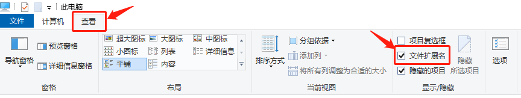

# 一：HTML

## 1.1 HTML概述

​	

​	HTML是（Hyper Text Markup Language）的缩写，即“超文本标记语言”。

​	使用HTML语言可以在网络文档（网页）上，呈现出丰富的元素，如：文字、图片、音频、视频、动画、表格、链接等。


## 1.2 网络文档（网页）

​	

​	网络文档（页面），以 .html 或 .htm 作为文件扩展名。


### 1.2.1 文档创建

​	

​	首先我们要确定，当前操作系统设置中，是否已经【显示扩展名】。

​	以 Windows 10 系统为例：【此电脑】 > 【查看】 > 【文件扩展名】





​	这样操作完，确保我们可以看到的文件的完整文件名和扩展名。

***

​	下一步，我们就要新建一个文件，并为其设置文件名及扩展名了，其中扩展名必须以 .html 或 .htm 命名。

​	

​	

### 1.2.2 编辑文档

​	

​	要对刚才新建的文档，进行内容编辑，我们只需要用任务一种文本方式打开文档即可。

​	以 Windows 10 系统为例：【右键】 > 【打开方式】 > 【记事本】


​	编辑完别忘记【保存】。


### 1.2.3 预览文档

​	

​	要对编辑完的文档，进行网络文档（网页）预览，我们只需要用任务一种浏览器打开文档即可。

​	以 Google浏览器为例：【右键】 > 【打开方式】 > 【Google Chrome】


​	当然，到目前为止，我们只能在网络文档（网页）中编写文字。

​	想要添加更多丰富的元素，我们就要使用 HTML 超文本标记。


## 1.3 超文本标记

### 1.3.1 标记的分类

​	

​	超文本标记分为两大类：

	* 单标记：<标记名 />
 * 双标记：<标记名></标记名>  


​	两种标记的格式非常明显，它们最大的区别在于：单标记内部不能再存放任务其它内容了，而双标记内部可以继续存放其它内容。

​	其它我们可以把一个网络文档（网页）的结构，看成一棵树，从唯一的树根开始，向上分叉。

​	双标记可以理解为树枝，它可以继续分叉。而单标记可以理解为树叶，它不可以继续分叉了，它是最终结点。


### 1.3.2 网络文档（网页）的基本标记结构


```html
<html>
    <head>
        <title>学掌门 www.atstudy.com</title>
    </head>
    <body>
        超全栈开发课程
    </body>
</html>
```

​	这便是网络文档（网页）的基本标记结构了。

​	【html】标记，是双标记。它是整个网络文档（网页）的根标记，所有的内容都必须放在【html】标记中。我们可以把它理解为唯一的树根。

​	【html】标记的内部，分叉出了【head】标记和【body】标记。

​	【head】标记，也是双标记。它表示网页的页头部分。

​	【body】标记，同样是双标记。它表示网页的正文部分。当前我们在正文部分写上了“超全栈开发课程”，稍后我们看下显示效果如何。

​	【head】标记的内部，又分叉出了【title】标记，同样是双标记，它表示页头的标题部分。当前我们在标题部分写上了“学掌门 www.atstudy.com”，我们看下显示效果如果。


### 1.3.3 标记的属性

​	

​	标记除了要知道标记名、标记类型，还有一个非常重要的组成部分，那就是属性。

​	属性的作用，是对标记的细节进行描述。

​	一个标记可以有多个属性描述。


* 单标记：<标记名 属性="值" 属性="值" 属性="值" ... />
* 双标记：<标记名 属性="值" 属性="值" 属性="值" ... ></标记名>


```html
<html>
    <head>
        <title>学掌门 www.atstudy.com</title>
    </head>
    <body bgcolor="pink">
        超全栈开发课程
    </body>
</html>
```

​		在【body】标记上，添加了一个属性【bgcolor】，值设置为【pink】。这样，整个网页正文部分的背景颜色，就成为了粉色。


​	

### 1.3.4 属性的分类


​	属性分为两类：

​	第一类，数据属性（Attribute）。就像上面这个案例，【bgcolor】就是一个数据属性，它的值通常是一种数据，可以自行设置，比如：pink（粉色）、green（绿色）、blue（蓝色）等。

​	第二类，状态属性（Property）。这类属性一般值只有两个：【是】或【否】。比如：【readonly】只读模式、【disabled】禁用模式、【checked】选中状态等。


```html
<html>
    <head>
        <title>学掌门 www.atstudy.com</title>
    </head>
    <body bgcolor="pink">
        <input type="checkbox" checked="checked"/> HTML5技能Get  <br/>
        <input type="checkbox" /> CSS3技能Get  <br/>
    </body>
</html>
```

​	可以看到，第一个【input】标记中，增加了一个【checked】属性。而第二个【input】标记，没有【checked】属性。来看下两者会呈现什么不同的效果。


​	区别很明显，第一个【input】标记处于选中状态，而第二个【input】标记没有处于选中状态。

​	因此可以得出结论，如果你需要让某个标记处于选中状态，就增加【checked】状态属性。而如果你不希望标记处于选中状态，那就不要增加【checked】状态属性。（其它状态属性同理）

​	那么，状态属性的值，看起来没什么作用？是的，没什么作用。

​	那为什么还要留着状态属性的值，可以去掉吗？是的，可以去掉。

```html
<html>
    <head>
        <title>学掌门 www.atstudy.com</title>
    </head>
    <body bgcolor="pink">
        <input type="checkbox" checked /> HTML5技能Get  <br/>
        <input type="checkbox" /> CSS3技能Get  <br/>
    </body>
</html>
```

​	把状态属性【checked="checked"】，改成【checked】，是完全一样的效果，而且更推荐这样的写法。（其它状态属性同理）


## 1.4 HTML总结

​	HTML标记的分类：

* 单标记：<标记名 数据属性="值" 数据属性="值" ... 状态属性 状态属性 .../>    （树叶，不能分叉）
* 双标记：<标记名 数据属性="值" 数据属性="值" ... 状态属性 状态属性 ...></标记名>     （树枝，可以分叉）


​	整个HTML部分的课程，都是围绕着标记展开。

​	学习HTML，就是学习一个一个HTML标记。标记名是什么？单标记还是双标记？有哪些数据属性？有哪些状态属性？这四个问题搞明白，一个标记就学完了。


# 二：HTML5

​	

​	【HTML5】 其实就是 【HTML】的版本号。

​	【HTML5】 是最新的 【HTML】版本。

​	【HTML5】 主要的提升在于，浏览器的多平台兼容上，包括：PC、平板电脑、手机、智能TV等。


# 三：集成开发工具 IDE


​	之前的网络文档（网页）编辑，都是在文本文档中进行的，确实，理论上开发软件，只要用任意一种文本编辑器都可以做到。但是实际上，这是非常没有必要的，有很多良好的【集成开发工具】（IDE）可以使用，比如：HBuilder(x)、VSCode等。

​	以HBuilder(x)为例，去官网下载IDE：https://www.dcloud.io/hbuilderx.html

​	

​	

​	点击【DOWNLOAD】按钮后，选择对应操作系统，下载【标准版】：


​	下载压缩文件，解压缩后，运行【HBuilderX.exe】即可使用。

***

​	首先新建一个项目：【文件】 > 【新建】 > 【项目】。弹出选项卡：


​	点击【创建】，即可完成项目创建。


​	